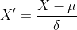
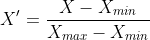
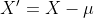

# data-preprocessing
机器学习领域中几种常见的数据预处理方法：  
1.标准化  
该方法将数据的分布转换为标准正态分布。一般情况下，我们都会假设原始数据的feature都是来自于相互独立的正态分布。据说，这可以加快神经网络的训练，提高其收敛速度。  
  
2.归一化  
该方法将数据的范围缩放为[0,1]或[-1,1]。这样可以消除不同量纲对计算的影响，例如距离计算等。  
  
3.中心化  
该方法将数据的中心调整为原点。  

